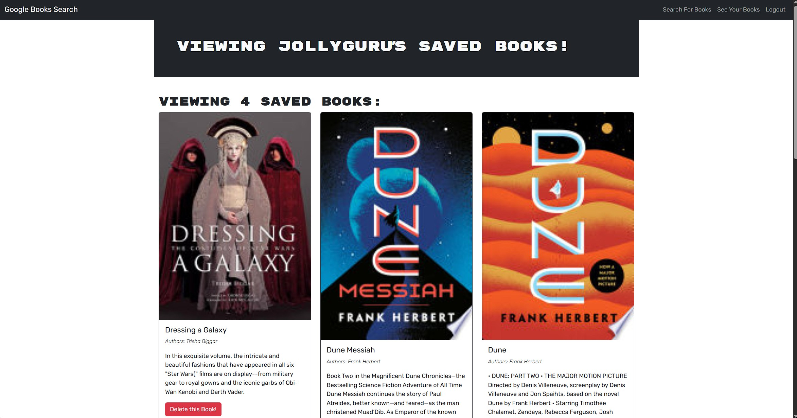

# Book Search Engine

## Description

The **Book Search Engine** is a full-stack MERN (MongoDB, Express, React, Node.js) application that allows users to search for books using the Google Books API. Users can save books to their account and manage their saved books. The application is built with [Apollo Server](https://www.apollographql.com/docs/apollo-server/) for GraphQL API communication and [Mongoose](https://mongoosejs.com/) for database management.

**Live Demo**: [Book Search Engine](https://book-search-apollo-mongoose.onrender.com)

## Table of Contents

-   [Book Search Engine](#book-search-engine)
    -   [Description](#description)
    -   [Table of Contents](#table-of-contents)
    -   [Features](#features)
    -   [Prerequisites](#prerequisites)
    -   [Technologies Used](#technologies-used)
    -   [Installation](#installation)
    -   [Usage](#usage)
    -   [Screenshots](#screenshots)
        -   [Search for Books](#search-for-books)
    -   [License](#license)

---

## Features

-   Search for books using the Google Books API.
-   Save books to your account (requires login).
-   View and manage your saved books.
-   User authentication with JWT (JSON Web Tokens).
-   Responsive design for mobile and desktop devices.

---

## Prerequisites

Before you begin, ensure you have the following installed on your system:

-   [Node.js](https://nodejs.org/) (v16 or higher)
-   [npm](https://www.npmjs.com/) (comes with Node.js)
-   [MongoDB](https://www.mongodb.com/) (local or cloud-based, e.g., [MongoDB Atlas](https://www.mongodb.com/atlas))
    -   **Note**: You will need a MongoDB account to use MongoDB Atlas. You can sign up using your email or connect with GitHub.
-   A [Google Books API Key](https://developers.google.com/books/docs/v1/using#APIKey) (optional, if required for extended functionality)
    -   **Note**: You will need a Google account to generate an API key.
-   A GitHub account (optional, for cloning the repository and contributing).

---

## Technologies Used

-   **Frontend**:
    -   [React](https://reactjs.org/)
    -   [React Router](https://reactrouter.com/)
    -   [Apollo Client](https://www.apollographql.com/docs/react/)
    -   [Bootstrap](https://getbootstrap.com/)
-   **Backend**:
    -   [Node.js](https://nodejs.org/)
    -   [Express.js](https://expressjs.com/)
    -   [Apollo Server](https://www.apollographql.com/docs/apollo-server/)
    -   [GraphQL](https://graphql.org/)
    -   [Mongoose](https://mongoosejs.com/)
-   **Database**:
    -   [MongoDB](https://www.mongodb.com/)
        -   **Note**: MongoDB Atlas requires an account, which can be created using GitHub.
-   **Authentication**:
    -   [JSON Web Tokens (JWT)](https://jwt.io/)
    -   [bcrypt](https://github.com/kelektiv/node.bcrypt.js)
-   **Build Tools**:
    -   [Vite](https://vitejs.dev/)
    -   [TypeScript](https://www.typescriptlang.org/)

---

## Installation

1. Clone the repository:

    ```bash
    git clone https://github.com/your-username/book-search-apollo.git
    cd book-search-apollo
    ```

2. Install dependencies for both the client and server:

    ```bash
    npm run install
    ```

3. Set up environment variables:
   Create a `.env` file in the `server` directory with the following:

    ```bash
    MONGODB_URI=<your-mongodb-uri>
    JWT_SECRET_KEY=<your-secret-key>
    ```

4. Build for both client and server:

    ```bash
    npm run build
    ```

5. Start the development server:

    ```bash
    npm run develop
    ```

6. Open your browser by clicking on the link in the terminal:
    ```bash
    http://localhost:3000
    ```

---

## Usage

1. **Search for Books**:

    - Use the search bar to find books by title, author, or keyword.

2. **Save Books**:

    - Sign up and log in to save books to your account.

3. **Manage Saved Books**:
    - View your saved books and remove any you no longer want.

---

## Screenshots

### Search for Books



---

## License

This project is licensed under the MIT License. See the [LICENSE](LICENSE) file for details.
